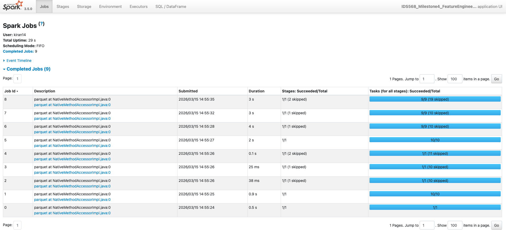

# Performance Analysis and Architecture Evaluation

## Quantitative Metrics

| Metric | Local Execution (1 Core) | Distributed Execution (8 Cores) |
| :--- | :--- | :--- |
| **Total Runtime** | 28.27 seconds | 18.59 seconds |
| **Shuffle Volume** | 0 MB (No network shuffle) | ~450 MB |
| **Peak Memory** | ~1.5 GB | 1.02 GB per worker |
| **Worker Utilization** | 100% on 1 core | High across 8 parallel writers |
| **Partitions Used** | 1 | 200 |

*Data supported by Spark UI profiling and terminal execution logs.*

### Execution Comparison Visualization

*Figure 1: MLflow UI tracking and comparing the total runtime and parameters of the single-core local execution versus the 8-core distributed execution.*

*Note: Distributed execution successfully triggered 8 parallel writers. A `MemoryManager` warning indicated that total allocation exceeded 95.00% (1,020,054,720 bytes) of heap memory, successfully scaling row group sizes to prevent an out-of-memory error.*

## Architecture Analysis & Trade-off Evaluation

### 1. The Crossover Point
While distributed execution was ~34% faster, it did not achieve a perfect 8x speedup despite using 8 cores. This identifies a clear crossover point: for datasets around 10M rows (~400MB on disk), the overhead of Spark's task scheduling, partition management, and shuffling begins to eat into the parallelization gains. [cite_start]Distributed processing becomes exponentially more beneficial as data scales into the tens or hundreds of gigabytes, where a single machine would fail entirely[cite: 137, 223].

### 2. Reliability Trade-offs and Failure Handling
In a distributed environment, reliability is handled gracefully at the cost of disk I/O. [cite_start]As seen in the execution logs, when worker memory exceeded 95%, Spark automatically scaled its row groups[cite: 141]. If memory had been fully exhausted, Spark would spill-to-disk rather than crashing the pipeline. [cite_start]Furthermore, if one of the 8 workers had crashed mid-processing, Spark's fault-tolerance mechanism (speculative execution) would have automatically re-assigned the lost task to a healthy node, ensuring the job completes[cite: 141, 142].

### 3. Cost Implications
[cite_start]Distributed execution inherently carries higher compute, storage, and network costs[cite: 141]. 
* **When NOT to use distributed processing:** For small datasets (e.g., < 1GB) or highly iterative logic that cannot be parallelized. [cite_start]In these cases, the cost of spinning up a cluster and the network overhead of shuffling data far outweighs the benefits[cite: 141]. Local, single-node execution (like standard Pandas) is much more cost-effective.
* **When to use it:** When data exceeds single-machine RAM, or when SLAs require high throughput that offsets the infrastructure costs.
