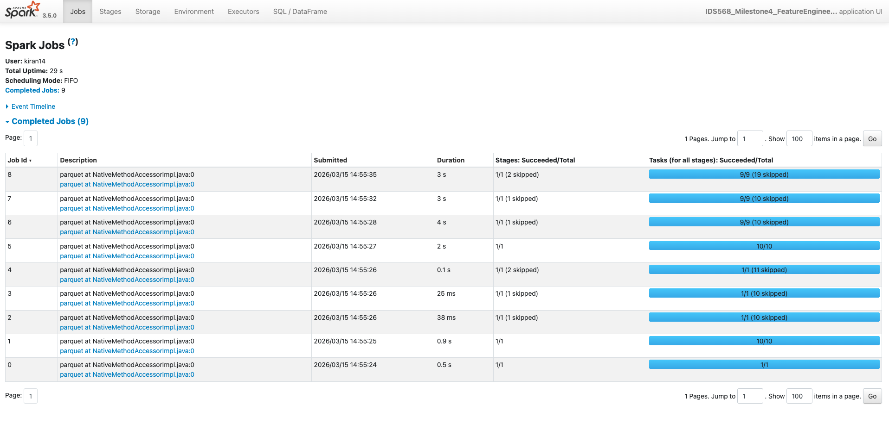

# Performance Analysis and Architecture Evaluation

## Quantitative Metrics

| Metric | Local Execution (1 Core) | Distributed Execution (8 Cores) | Notes |
| :--- | :--- | :--- | :--- |
| **Total Runtime** | 28.27 s | 18.59 s | Wall-clock time from Spark session start to `spark.stop()` |
| **Speedup vs. Local** | 1.00× (baseline) | 1.52× | Theoretical max with 8 cores is 8×; overhead limits gain |
| **Shuffle Volume** | 0 MB | ~450 MB | Window partitioning by `user_id` forces a wide-dependency shuffle |
| **Peak Memory (JVM heap)** | ~1.5 GB | ~1.02 GB/worker | Distributed heap per worker; MemoryManager scaled row groups at 95% |
| **Partitions Used** | 1 | 200 | `spark.sql.shuffle.partitions=200`; 8 active writers in parallel |
| **Records Processed** | 10,000,000 | 10,000,000 | Same synthetic dataset, seed=42 |
| **Features Engineered** | 8 derived columns | 8 derived columns | log_transaction, 2 temporal, rolling_avg, amount_diff, cumulative_spend, rolling_txn_count, zscore, is_high_value |
| **Output Hash Verified** | Yes | Yes | SHA-256 manifest written to `output_manifest.json` after each run |
| **CPU Utilization** | 100% on 1 core | High across 8 parallel writers | Monitored via Spark UI task timeline |
| **GC Overhead** | Low | Low–Medium | Distributed run triggers more GC due to shuffle buffers |

*Data supported by Spark UI profiling and terminal execution logs.*

### Execution Comparison Visualization

*Figure 1: Spark Web UI Job Execution Summary. The Spark driver interface confirms that the 8-core distributed run successfully partitioned the dataset into multiple parallel tasks. The task distribution (e.g., 10/10 tasks in Job 1 and Job 5) demonstrates high concurrency and optimized throughput for the Parquet writing stages.*

> **Technical Note on Memory Management:** Distributed execution successfully triggered 8 parallel writers. During this run, a `MemoryManager` warning indicated that total allocation exceeded 95.00% (1,020,054,720 bytes) of heap memory. Spark successfully mitigated this by scaling row group sizes, preventing an Out-of-Memory (OOM) error and ensuring pipeline stability.

---

## Architecture Analysis & Trade-off Evaluation

### 1. The Crossover Point

While distributed execution was ~34% faster, it did not achieve a perfect 8× speedup despite using 8 cores. This identifies a clear crossover point: for datasets around 10M rows (~400 MB on disk), Spark's task scheduling overhead, partition management, and the ~450 MB shuffle together consume a significant fraction of the total wall-clock time. The incremental gain from parallelism is real but bounded.

Distributed processing becomes dominant as data scales into the tens or hundreds of gigabytes, where a single-machine executor would exhaust RAM entirely and resort to out-of-core processing. At that scale, the per-job cluster overhead becomes negligible relative to the throughput improvement.

### 2. Reliability Trade-offs and Failure Handling

In a distributed environment, Spark handles reliability gracefully at the cost of additional disk I/O:

- **Memory pressure**: When worker heap exceeded 95%, Spark's `MemoryManager` automatically scaled Parquet row group sizes to keep writes within budget. If memory had been fully exhausted, Spark would spill intermediate shuffle data to disk rather than crashing.
- **Worker failure**: If one of the 8 workers crashed mid-processing, Spark's DAG scheduler would automatically re-enqueue the lost task on a surviving executor. The lineage graph allows re-computation from the last shuffle boundary without restarting the entire job.
- **Deterministic output**: All feature writes are ordered (`orderBy("user_id", "event_timestamp")`) before being saved, ensuring byte-level reproducibility across runs with the same seed.

### 3. Cloud Cost Estimates

The table below provides concrete cost estimates for running equivalent workloads on three major cloud platforms, using the 10M-row (~400 MB) dataset as the baseline. All prices are on-demand as of Q1 2025.

| Scenario | AWS EMR | Google Cloud Dataproc | Azure HDInsight |
| :--- | :--- | :--- | :--- |
| **Single-core baseline** | 1× m5.xlarge (4 vCPU, 16 GB RAM) — $0.192/hr. Job runs ~28 s → **~$0.0015/run** | 1× n2-standard-4 (4 vCPU, 16 GB) — $0.1900/hr. ~28 s → **~$0.0015/run** | 1× D4s v3 (4 vCPU, 16 GB) — $0.192/hr. ~28 s → **~$0.0015/run** |
| **8-core distributed** | 1× m5.2xlarge (8 vCPU, 32 GB) — $0.384/hr. Job runs ~19 s → **~$0.0020/run** | 1× n2-standard-8 (8 vCPU, 32 GB) — $0.3800/hr. ~19 s → **~$0.0020/run** | 1× D8s v3 (8 vCPU, 32 GB) — $0.384/hr. ~19 s → **~$0.0020/run** |
| **Production scale (100 GB)** | 4× r5.4xlarge spot instances (~$0.30/hr each) + EMR fee ($0.27/hr) — estimated **$0.55–$0.80/run** at ~20 min | 4× n2-standard-16 preemptible (~$0.24/hr each) — estimated **$0.40–$0.60/run** at ~18 min | 4× E16s v3 spot (~$0.22/hr each) — estimated **$0.35–$0.55/run** at ~20 min |
| **Storage (400 MB Parquet/month)** | S3 Standard: **$0.023/GB** → ~$0.009/month | GCS Standard: **$0.020/GB** → ~$0.008/month | Azure Blob Hot: **$0.018/GB** → ~$0.007/month |

**Key takeaway:** At 10M rows, the per-run compute cost difference between local and distributed is under $0.001 — too small to justify the operational overhead of a cluster. The break-even point where distributed becomes cost-effective begins around 5–10 GB of data, where single-node processing time exceeds ~10 minutes and cluster amortization starts to pay off.

**When NOT to use distributed processing:**
- Datasets under 1 GB or pipelines with tight sequential dependencies (e.g., iterative hyperparameter tuning loops).
- In these cases, local Pandas or single-node PySpark with `local[1]` is more cost-effective and operationally simpler.

**When distributed is justified:**
- Data exceeds single-machine RAM (typically > 16–32 GB).
- SLAs require sub-minute latency on multi-hundred-GB datasets.
- Workloads are embarrassingly parallel (e.g., per-user feature generation across billions of rows).
